# Salvadindin

Sistema simples de controle financeiro pessoal feito em PHP e PostgreSQL.

Acesse e teste: https://salvadindin.online/

## Recursos

- Cadastro e login de usuarios
- Dashboard financeiro
- Lancamentos de receitas e despesas
- Metas financeiras
- Investimentos
- Painel administrativo

## Requisitos

- PHP 8.2+
- PostgreSQL 14+
- Servidor web apontando para a pasta `public`

## Configuracao

1. Copie o arquivo de ambiente:

```bash
cp .env.example .env
```

2. Ajuste as variaveis do banco e da URL no `.env`.

3. Crie o banco PostgreSQL e importe a estrutura:

```bash
psql -U salvadindin_user -d salvadindin -f database/schema.sql
```

4. Configure o servidor web para usar `public` como raiz do site.

## Prints

<p>
  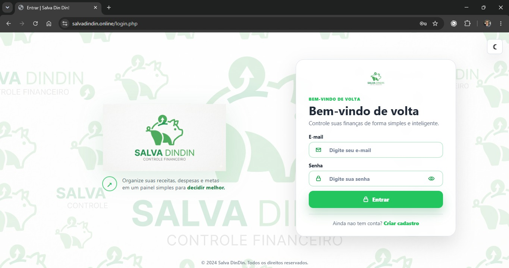
  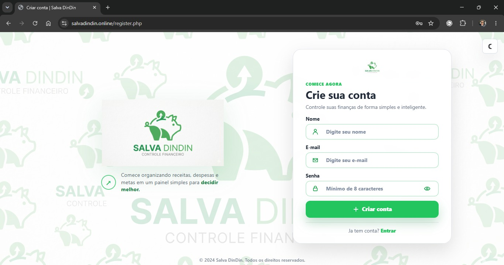
  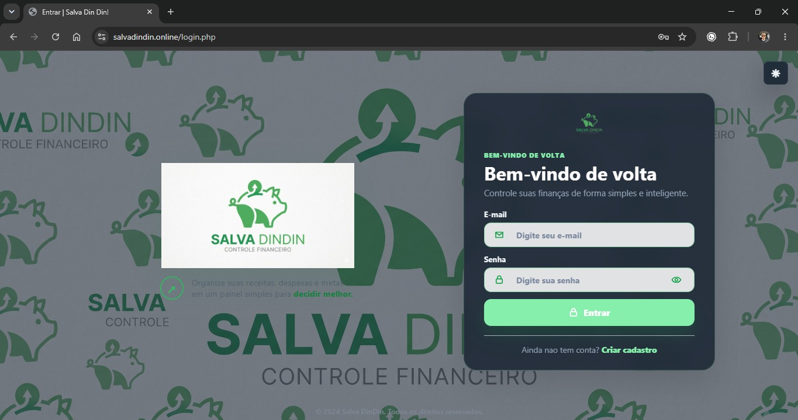
  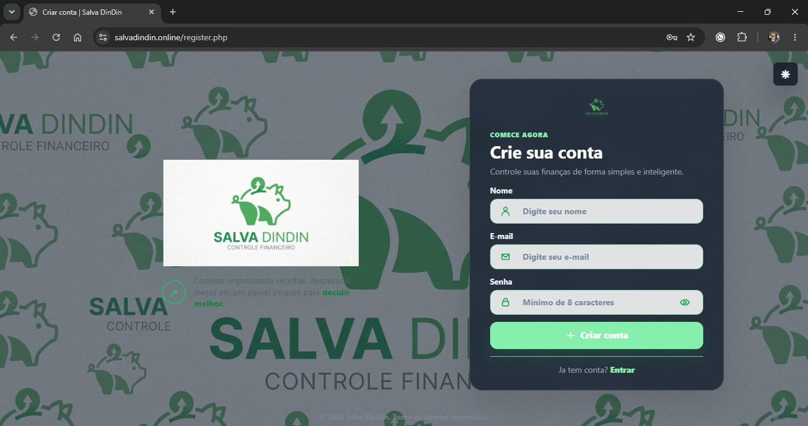
  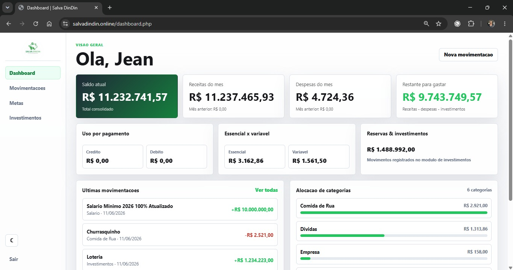
  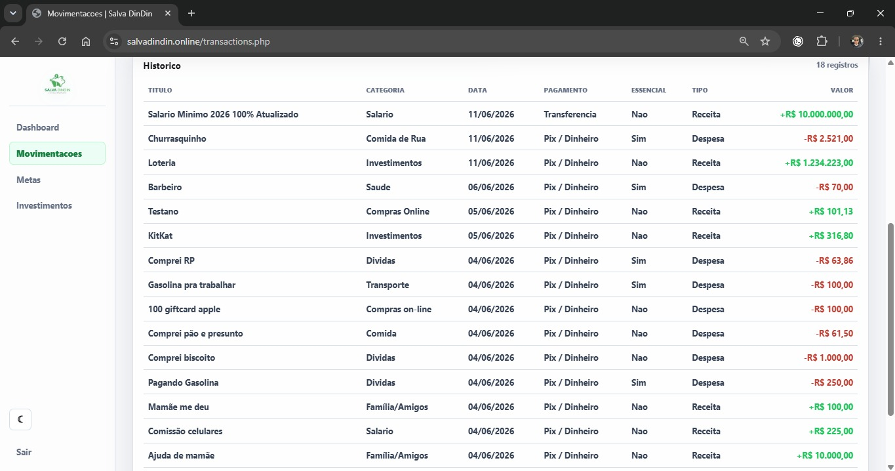
  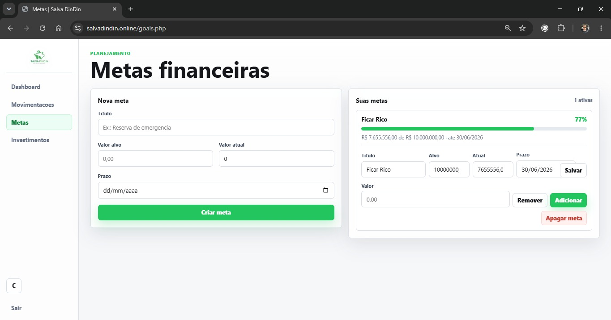
  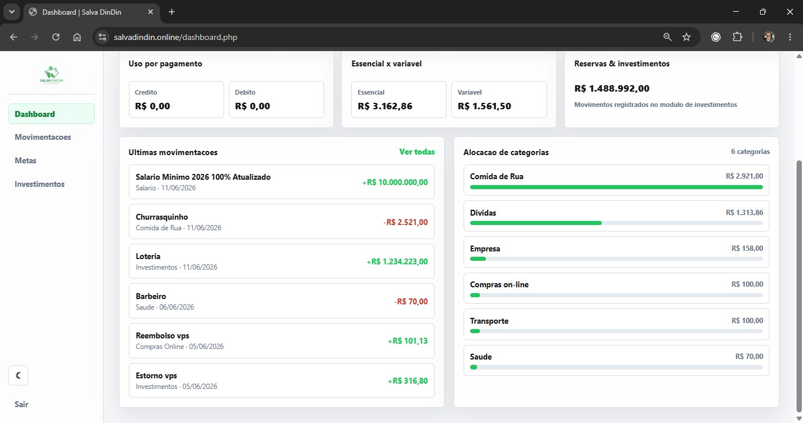
  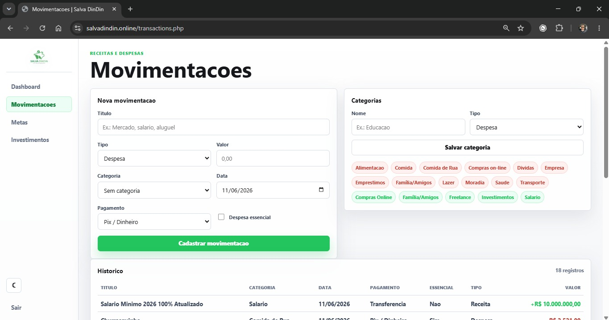
  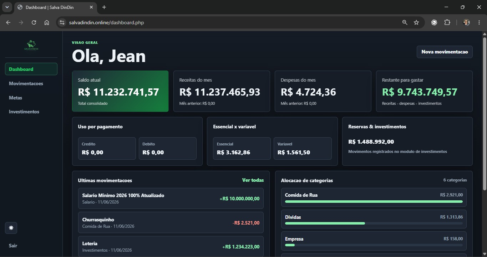
  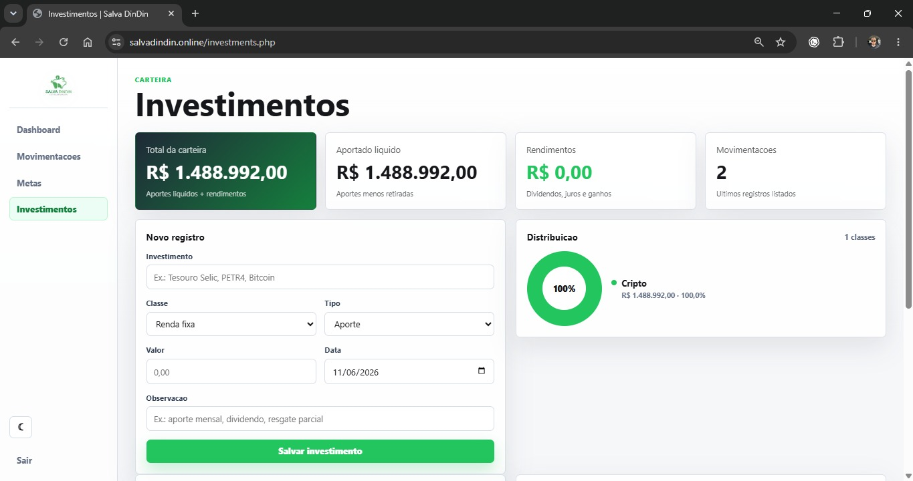
</p>

## Seguranca

O arquivo `.env` real nao deve ser publicado. Use apenas `.env.example` como referencia.
